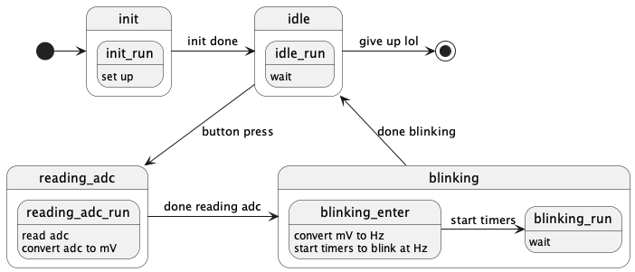

# Embedded Heart Rate Monitor

A high-performance embedded application developed on the nRF52833DK, demonstrating professional-grade firmware design using the Zephyr RTOS, Bluetooth Low Energy (BLE) connectivity, and real-time signal processing.



## Core Technical Competencies

| Area | Demonstrated Skills |
| :--- | :--- |
| **Wireless Connectivity** | Bluetooth Low Energy (BLE) Advertising, GATT Services, Data Streaming |
| **RTOS Architecture** | Multithreading (K_THREAD), Preemptive Scheduling, Timers, Work Queues |
| **State Management** | Zephyr SMF (State Machine Framework), Asynchronous Event Handling |
| **Peripheral Drivers** | ADC (Single-ended & Differential), PWM Modulation, GPIO Callbacks |
| **Low-Level Design** | Hardware Abstraction (Devicetree), Hardware Overlays, Memory Buffering |
| **Signal Processing** | Zero-Crossing Analysis, Frequency Domain Analytics, Heart Rate Logic |
| **Testing & CI/CD** | Data Validation (Python/Jupyter), HW-in-the-Loop Verification, Logging |

---

## Overview

The Embedded Heart Rate Monitor is a modular firmware solution implemented on the nRF52833DK. It manages resource-constrained hardware environments by combining high-speed asynchronous data acquisition with structured control flow. The project demonstrates a complete H/W-S/W lifecycle: from low-level driver configuration to wireless data transmission and digital signal analysis.

---

## Key Technical Highlights

### Wireless Data Transmission (BLE)
*   **Heart Rate Profile**: Implements standard Bluetooth SIG Heart Rate Service (HRS) and Battery Service (BAS) for compatibility with mobile health applications.
*   **High-Bandwidth Streaming**: Optimized BLE connection parameters to ensure reliable real-time transmission of pulse waveforms and processed heart rate data.

### Structured State Machine (SMF)
The system architecture uses a non-blocking Finite State Machine (FSM) via the Zephyr SMF, ensuring robust transitions between:
*   **Asynchronous Interrupts**: External button triggers managing mode switches.
*   **State-Specific Logic**: Segregated handling of DC voltage mapping vs. high-speed heart rate signal processing.
*   **Encapsulation**: Clean separation of initialization, data acquisition, and processing logic.

### Real-Time Signal Pipeline
*   **Differential ADC Sampling**: Implemented high-fidelity sampling of heart rate signals (sinusoidal pulses) using differential configuration with internal buffering to minimize kernel overhead.
*   **Pulse Analytics**: A custom C library (calc_cycles) performs zero-crossing analysis on raw ADC buffers to determine heart rate frequency in real-time.

### Concurrent Resource Management
*   **Dedicated Kernel Threads**: A high-priority Heartbeat thread pulse ensures system health monitoring remains uninterrupted by continuous ADC and BLE processing.
*   **Asynchronous Timers**: Sophisticated use of Zephyr timers to manage visual feedback and sampling intervals without blocking the main execution path.

---

## Technical Stack

*   **Runtime**: Zephyr RTOS (v3.x+)
*   **Wireless**: Bluetooth Low Energy (BLE)
*   **Language**: C (Embedded-optimized), Python (Analytics)
*   **Protocols**: GATT, ADC, PWM, GPIO.
*   **Tools**: west, GCC ARM Compiler, Jupyter Notebooks.

---

## Deployment

### Build & Flash
```bash
# Optimized build for nRF52833DK
west build -b nrf52833dk
west flash
```

---

## Repository Layout

*   `src/main.c`: Core application showcasing SMF and HRM implementation.
*   `src/calc_cycles.c`: Modular signal processing library for pulse analysis.
*   `boards/`: Custom hardware configuration via Devicetree.
*   `testing/`: Technical reports validating signal processing accuracy.